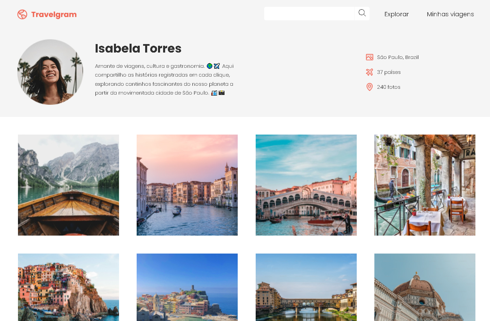

# 🌍 Travelgram

<p align="center">
  
</p>

<p align="center">
  <a href="https://anaclarissi.github.io/travelgram-website/">
    
  </a>

  <a href="https://github.com/anaClarissi/travelgram-website">
    
  </a>

  <a href="https://www.figma.com/design/DK0NgNbxkcxgClMrt9dl7A/Perfil-de-viagens--Community-?t=AsSLTnlHS3BIMpwS-0">
    
  </a>
</p>

---

## 📌 Sobre o Projeto

O **Travelgram** é um projeto desenvolvido para praticar **HTML**, **CSS**, **Bootstrap** e **JavaScript**, recriando uma página de perfil de viagens moderna e responsiva.

O site simula uma rede social focada em compartilhamento de fotos e experiências de viagem, apresentando uma galeria dinâmica e um layout adaptável para diferentes dispositivos.

---

## 🚀 Live Preview

🔗 https://anaclarissi.github.io/travelgram-website/

---

## 💻 Repositório

📂 https://github.com/anaClarissi/travelgram-website

---

## 🎨 Layout no Figma

🖌️ https://www.figma.com/design/DK0NgNbxkcxgClMrt9dl7A/Perfil-de-viagens--Community-?t=AsSLTnlHS3BIMpwS-0

---

## 🛠️ Tecnologias Utilizadas

- HTML5
- CSS3
- JavaScript
- Bootstrap 5
- Phosphor Icons

---

## 📂 Estrutura do Projeto

```bash
📁 travelgram-website
 ┣ 📁 src
 ┃ ┣ 📁 css
 ┃ ┃ ┗ style.css
 ┃ ┣ 📁 images
 ┃ ┗ 📁 js
 ┃   ┗ index.js
 ┣ 📄 index.html
 ┗ 📄 README.md
````

---

## ✨ Funcionalidades

* Navbar responsiva
* Perfil de usuário estilizado
* Galeria de fotos dinâmica com JavaScript
* Layout responsivo para:

  * Mobile
  * Tablet
  * Desktop
* Efeitos hover interativos

---

## 🧠 Aprendizados

Durante o desenvolvimento desse projeto pratiquei:

* Responsividade com media queries
* Estruturação de layouts com CSS Grid
* Alinhamento com Flexbox
* Manipulação do DOM com JavaScript
* Criação dinâmica de elementos HTML
* Uso do Bootstrap para componentes responsivos
* Organização de arquivos em projetos front-end

---

## ⚡ Desafios

Alguns desafios encontrados durante o projeto:

* Ajustar a navbar para diferentes telas
* Organizar a galeria responsiva
* Gerar imagens dinamicamente com JavaScript
* Manter consistência visual entre os elementos

---

## 🔮 Melhorias Futuras

* Adicionar animações suaves
* Implementar busca funcional
* Criar tema dark/light
* Consumir uma API para posts dinâmicos
* Melhorar acessibilidade

---

## 👩‍💻 Autora

Feito com ❤️ por **Ana Clarissi**

* GitHub: [https://github.com/anaClarissi](https://github.com/anaClarissi)

---
